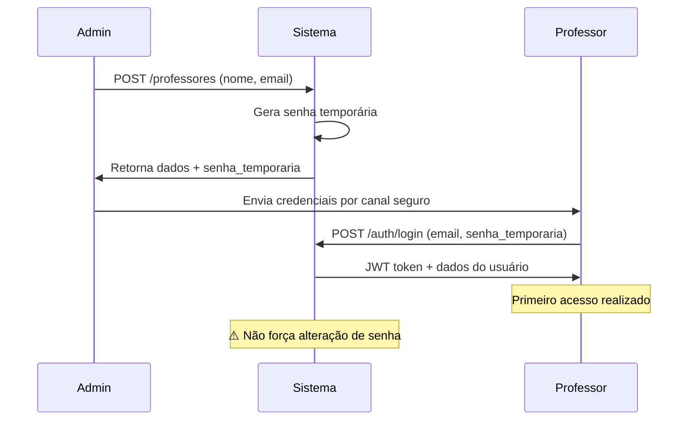

# 👨‍🏫 Cadastro de Professores e Primeiro Acesso

## 🎯 Visão Geral

O sistema Educatio implementa um processo de cadastro de professores com senha temporária, onde apenas administradores podem cadastrar novos professores. O professor recebe uma senha temporária gerada automaticamente durante o cadastro.

## 🔐 Processo de Cadastro

### 1. Cadastro pelo Administrador

**Endpoint:** `POST /professores`

**Quem pode executar:** Apenas usuários com role `admin`

**Processo:**

1. Administrador fornece apenas nome e email do professor
2. Sistema gera automaticamente uma **senha temporária aleatória** de 8 caracteres
3. Senha temporária contém:
   - 1 letra maiúscula
   - 1 letra minúscula
   - 1 número
   - 1 caractere especial (!@#$%^&\*)
   - 4 caracteres adicionais aleatórios

**Exemplo de Requisição:**

```json
{
  "nome": "João Silva",
  "email": "joao.silva@instituicao.edu.br"
}
```

**Resposta do Sistema:**

```json
{
  "id": 15,
  "nome": "João Silva",
  "email": "joao.silva@instituicao.edu.br",
  "role": "professor",
  "senha_temporaria": "A2b#kL9z",
  "criado_em": "2025-07-14T10:30:00Z",
  "atualizado_em": "2025-07-14T10:30:00Z"
}
```

### 2. Comunicação da Senha

**⚠️ IMPORTANTE:**

- A senha temporária é retornada **apenas no momento do cadastro**
- O administrador deve comunicar a senha ao professor por canal seguro
- A senha não fica armazenada em texto plano no sistema

## 🔑 Primeiro Acesso do Professor

### Situação Atual

**Estado:** O sistema atualmente **não possui** funcionalidade automática para forçar alteração de senha no primeiro login.

**Como funciona hoje:**

1. Professor recebe email e senha temporária do administrador
2. Professor faz login normalmente com as credenciais recebidas
3. Acesso é liberado imediatamente - não há obrigatoriedade de alterar a senha

### Login Normal

**Endpoint:** `POST /auth/login`

**Requisição:**

```json
{
  "email": "joao.silva@instituicao.edu.br",
  "senha": "A2b#kL9z"
}
```

**Resposta:**

```json
{
  "accessToken": "eyJhbGciOiJIUzI1NiIsInR5cCI6IkpXVCJ9...",
  "user": {
    "id": 15,
    "nome": "João Silva",
    "email": "joao.silva@instituicao.edu.br",
    "role": "professor",
    "criado_em": "2025-07-14T10:30:00Z",
    "atualizado_em": "2025-07-14T10:30:00Z"
  }
}
```

## 🛡️ Considerações de Segurança

### Pontos Fortes Atuais:

- ✅ Senha gerada automaticamente (sem intervenção humana)
- ✅ Senha complexa com múltiplos tipos de caracteres
- ✅ Senha não armazenada em texto plano
- ✅ Apenas administradores podem cadastrar professores

### Recomendações para Melhoria:

- ⚠️ **Implementar obrigatoriedade de alteração no primeiro login**
- ⚠️ **Marcar senhas temporárias com flag específica**
- ⚠️ **Implementar expiração de senhas temporárias**
- ⚠️ **Adicionar endpoint para alteração de senha**

## 🔄 Endpoints Relacionados

### Cadastro de Professor

- **URL:** `POST /professores`
- **Auth:** Admin required
- **Guard:** `AdminGuard`
- **Retorna:** Dados do professor + senha temporária

### Login

- **URL:** `POST /auth/login`
- **Auth:** Não requerida
- **Retorna:** JWT token + dados do usuário

### Verificação de Token

- **URL:** `GET /auth/verificar`
- **Auth:** JWT required
- **Retorna:** Dados do usuário logado

## 📝 Fluxo Completo Recomendado



## 🎯 Próximos Passos Sugeridos

1. **Implementar endpoint para alteração de senha:**

   ```
   PUT /auth/alterar-senha
   Body: { senha_atual, nova_senha }
   ```

2. **Adicionar campo `senha_temporaria` no modelo Usuario:**

   ```prisma
   model Usuario {
     senha_temporaria Boolean @default(false)
     // outros campos...
   }
   ```

3. **Implementar middleware para verificar primeiro acesso:**

   - Interceptar requests após login
   - Verificar se `senha_temporaria = true`
   - Redirecionar para alteração obrigatória

4. **Adicionar expiração de senhas temporárias:**
   - Campo `senha_expira_em`
   - Validação na autenticação
